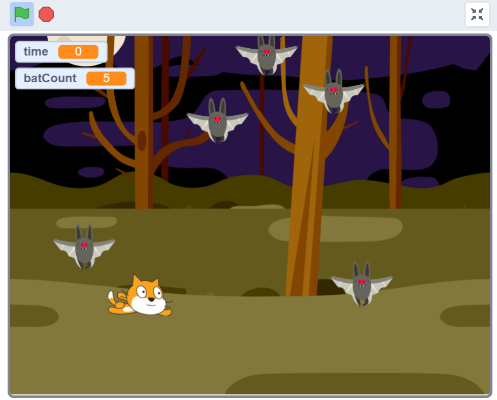

# batCatcher

Scratch bat catching game

How it works:
- Your arrow keys control the flying cat. Your goal is to catch all the bats on the screen as fast as you can. Each bat will move around randomly. When the bat is touched by the flying cat it will play a sound, say “I’ve been caught!”, and disappear.
- There is a variable for the amount of bats (reduced by one each time one is touched) and a variable for the amount of seconds it took to catch all of the bats. 
- Once all have the bats have been caught, the program ends.

Sprites:
- Flying Cat (x1), Bat(x5)
